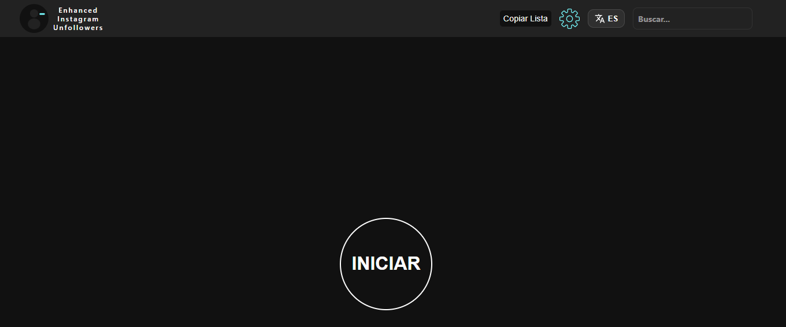
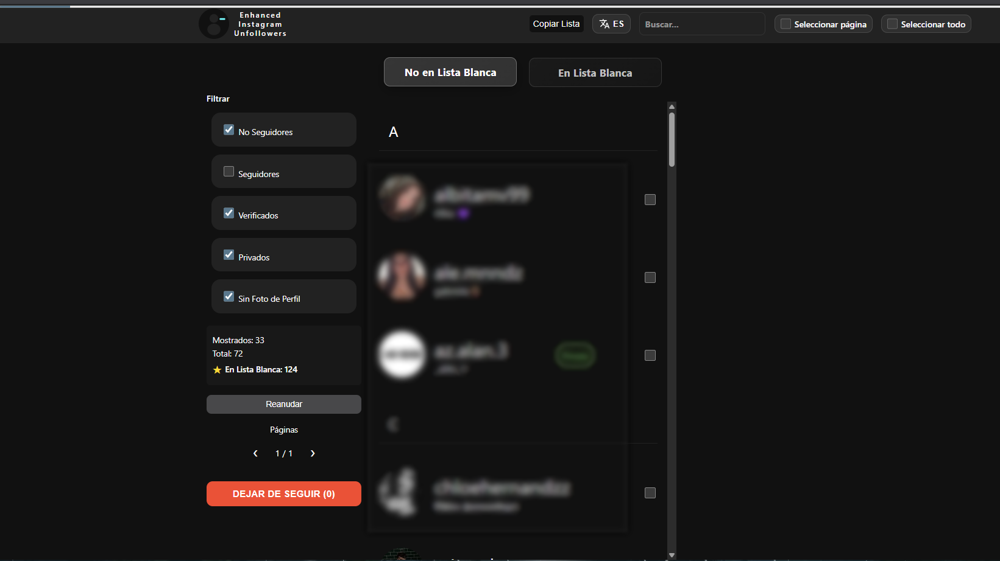
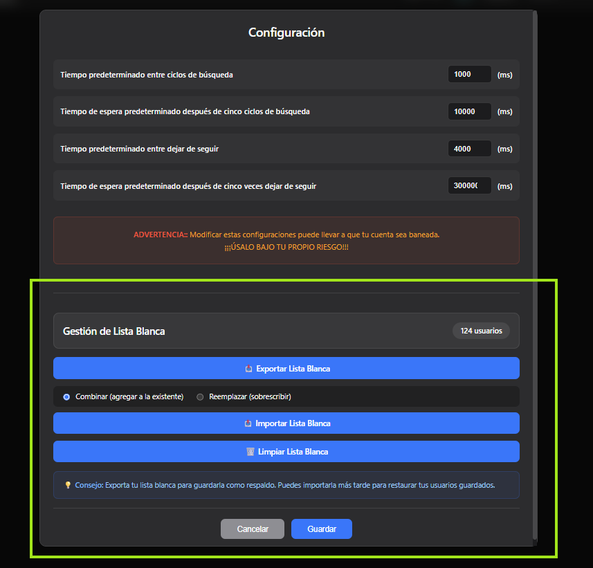

# 📱 Enhanced Instagram Unfollowers

[](https://github.com/Kl4rkx/EnhancedInstagramUnfollowers)

*Lee esto en otros idiomas: [English](../README.md)*

Una herramienta ingeniosa que te permite ver quién no te sigue de vuelta en Instagram.  
<u>¡Basada en navegador y no requiere descargas ni instalaciones!</u>

## ⚠️ ADVERTENCIA

Esta versión utiliza la API de Instagram para un mejor rendimiento.  

## 🖥️ Uso en Escritorio

1. Copia el código desde: [Enhanced Instagram Unfollowers Tool](https://kl4rkx.github.io/EnhancedInstagramUnfollowers)

2. Presiona el botón COPY para copiar el código.

   

3. Ve al sitio web de Instagram e inicia sesión en tu cuenta

4. Abre la consola de desarrollador:
   - Windows: `Ctrl + Shift + J`
   - Mac OS: `⌘ + ⌥ + I`

5. Pega el código y verás esta interfaz:

   

6. Haz clic en "INICIAR" para comenzar el escaneo

7. Después de que se complete el escaneo, verás los resultados:

   

8. 🤍 Añade usuarios a la lista blanca haciendo clic en su imagen de perfil

9. 💾 Gestiona tu lista blanca desde Configuración:
   - Exportar: Guarda tu lista blanca como un archivo de respaldo JSON
   - Importar: Restaura o combina usuarios de la lista blanca desde un archivo
   - Limpiar: Elimina todos los usuarios de la lista blanca
   
   ¡Tu lista blanca persiste automáticamente entre sesiones!

   

10. ✅ Selecciona usuarios para dejar de seguir usando las casillas de verificación

11. ⚙️ Personaliza los tiempos del script mediante el botón "Configuración"

## 📱 Uso en Móvil

Para usuarios de Android que quieran usarlo en móvil:

1. Descarga la última versión de [Eruda Android Browser](https://github.com/liriliri/eruda-android/releases/)
2. Abre Instagram web a través del navegador Eruda
3. Sigue los mismos pasos que en escritorio (la consola estará disponible automáticamente al hacer clic en el icono de eruda)

## 📚 Cómo Usar el Bookmarklet


### 💻 Para PC/Escritorio (Chrome, Firefox, Edge, Safari)

1. **Arrastra el enlace a tu barra de marcadores**
   - Haz clic y arrastra el enlace "Enhanced Instagram Unfollowers" a tu barra de marcadores/favoritos
   - Suéltalo para crear el bookmarklet

2. **Abre Instagram en tu navegador**
   - Ve a https://www.instagram.com y espera a que cargue completamente

3. **Haz clic en el bookmarklet**
   - Abre tu barra de marcadores y selecciona el bookmarklet que creaste
   - La herramienta se ejecutará automáticamente

4. **Disfruta de la interfaz**
   - Se mostrará la interfaz completa con los usuarios que no te siguen detectados

### 📱 Para iOS (Safari)


1. **Mantén presionado el enlace**
   - Mantén presionado el botón "Enhanced Instagram Unfollowers" hasta que aparezca un menú

2. **Arrastra a marcadores**
   - Sin soltar, arrastra el enlace a la barra de marcadores de Safari en la parte inferior
   - Suéltalo para guardar como bookmarklet

3. **Usa el bookmarklet**
   - Abre Instagram en Safari y espera a que cargue completamente
   - Toca el bookmarklet en tu barra de marcadores
   - ¡La herramienta se ejecutará y mostrará la interfaz de usuarios que no te siguen!


### ✨ Características del Bookmarklet

- 🎨 **Tema oscuro/claro automático** - Se adapta a las preferencias de tu sistema
- 🖥️ **Interfaz moderna y limpia** - Inspirada en el diseño de Apple
- 💻 **Compatible con PC y móvil** - Funciona en escritorio e iOS
- 🚀 **Carga rápida** - Bookmarklet optimizado y eficiente
- 🔒 **Privado y seguro** - Todo se ejecuta localmente en tu navegador

## ⚡ Notas de Rendimiento

- El tiempo de procesamiento aumenta con el número de usuarios a verificar
- El script funciona en navegadores basados en Chromium y Firefox
- El script tarda unos segundos más en cargar en móvil
- Los datos de la lista blanca se almacenan localmente en tu navegador (localStorage)

## ✨ Características

- 🔍 Escanea e identifica usuarios que no te siguen de vuelta
- 🤍 Sistema de lista blanca para proteger cuentas específicas de dejar de seguir
- 💾 Funcionalidad de exportar/importar lista blanca para respaldo y transferencia
- ⚙️ Configuración de tiempos personalizable para evitar límites de tasa
- 🎨 Interfaz limpia y minimalista inspirada en el diseño de Apple
- 📱 Totalmente responsive - funciona en escritorio y móvil
- 🔒 Todos los datos se almacenan localmente - sin servidores externos
- 🌐 Soporte bilingüe completo (Español/Inglés) con selector de idioma

## 🛠️ Desarrollo

### Requisitos Previos
- Versión de Node: 16.14.0 (Si usas nvm, ejecuta `nvm use`)
- Gestor de paquetes: pnpm (recomendado para mejor seguridad y rendimiento)

### Configuración
```bash
# Instala pnpm globalmente si aún no lo has hecho
npm install -g pnpm

# Instala las dependencias
pnpm install

# Compila el proyecto
pnpm run build

# Modo desarrollo con recarga automática
pnpm run build-dev
```

### Comandos
- `pnpm run build` - Compilar para producción
- `pnpm run build-dev` - Modo desarrollo con recarga en caliente
- `pnpm run webpack-build` - Compilar solo el bundle de webpack

### Migración de npm a pnpm
Este proyecto ha sido migrado a pnpm para:
- 🔒 Mejor seguridad (resolución de dependencias más estricta)
- 🚀 Instalaciones más rápidas (almacenamiento con direccionamiento de contenido)
- 💾 Eficiencia de espacio en disco (enlaces duros en lugar de copias)
- 🔐 Protección contra dependencias fantasma

Si eres un colaborador que todavía usa npm, por favor cambia a pnpm para mantener la consistencia.

## ⚖️ Legal y Licencia

**Descargo de responsabilidad:** Esta herramienta no está afiliada, asociada, autorizada, respaldada o conectada oficialmente con Instagram.

⚠️ ¡Úsala bajo tu propio riesgo!

📜 Licenciado bajo la [Licencia MIT](../LICENSE)
- ✅ Libre para usar, copiar y modificar
- 🤝 Código abierto y amigable con la comunidad
- 📋 Ver el archivo [LICENSE](../LICENSE) para términos completos
