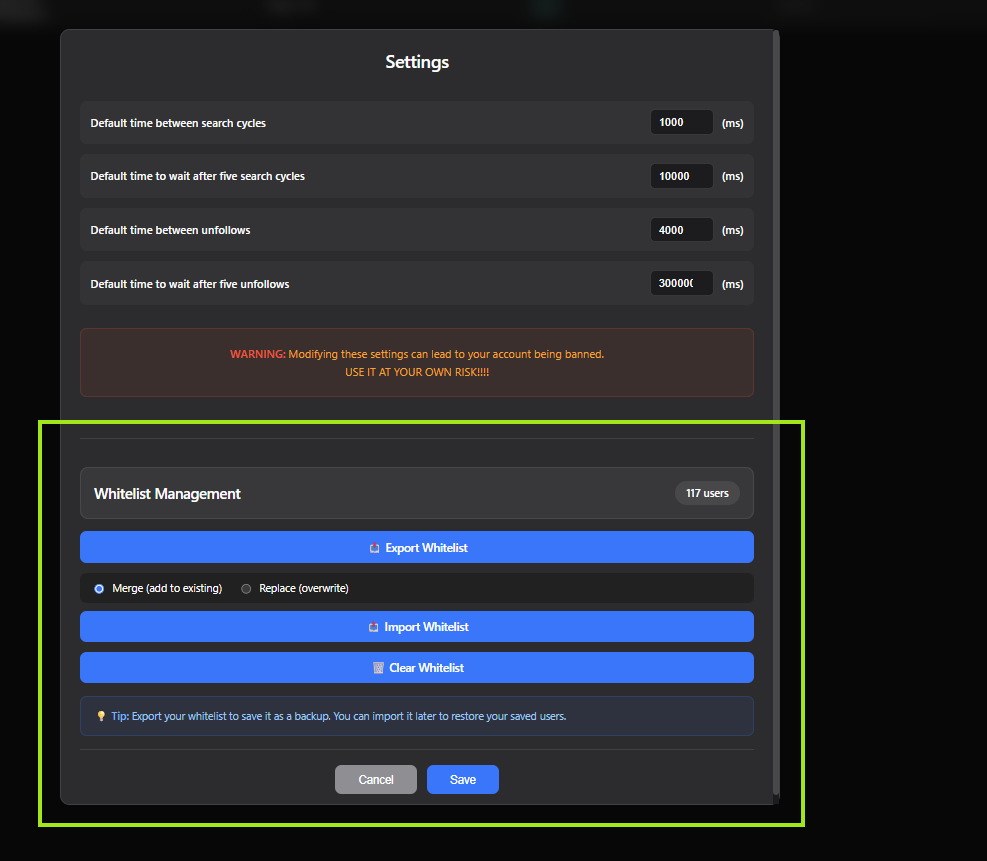
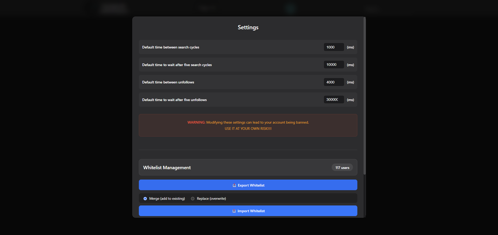
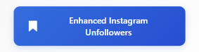
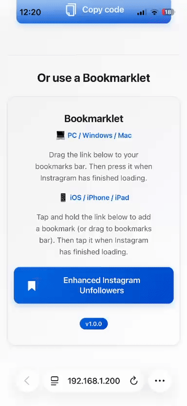

# 📱 Enhanced Instagram Unfollowers

[](https://github.com/Kl4rkx/EnhancedInstagramUnfollowers)

*Read this in other languages: [Español](.github/README.es.md)*

A nifty tool that lets you see who doesn't follow you back on Instagram.  
<u>Browser-based and requires no downloads or installations!</u>

## ⚠️ WARNING

This version utilizes the Instagram API for better performance.  

## 🖥️ Desktop Usage

1. Copy the code from: [Enhanced Instagram Unfollowers Tool](https://kl4rkx.github.io/EnhancedInstagramUnfollowers)

2. Press the COPY button to copy the code.

    

3. Go to Instagram website and log in to your account

4. Open the developer console:
   - Windows: `Ctrl + Shift + J`
   - Mac OS: `⌘ + ⌥ + I`

5. Paste the code and you'll see this interface:

    

6. Click "RUN" to start scanning

7. After scanning completes, you'll see the results:

    

8. 🤍 Whitelist users by clicking their profile image

9. 💾 Manage your whitelist via Settings:
   - Export: Save your whitelist as a JSON backup file
   - Import: Restore or merge whitelisted users from a file
   - Clear: Remove all users from whitelist
   
   Your whitelist persists between sessions automatically!

    

10. ✅ Select users to unfollow using the checkboxes

11. ⚙️ Customize script timings via the "Settings" button:

    

## 📱 Mobile Usage

For Android users who want to use it on mobile:

1. Download the latest version of [Eruda Android Browser](https://github.com/liriliri/eruda-android/releases/)
2. Open Instagram web through the Eruda browser
3. Follow the same steps as desktop (the console will be automatically available when clicking the eruda icon)

## 📚 How to Use the Bookmarklet



### 💻 For PC/Desktop (Chrome, Firefox, Edge, Safari)

1. **Drag the link to your bookmarks bar**
   - Click and drag the "Enhanced Instagram Unfollowers" link to your bookmarks/favorites bar
   - Release to create the bookmarklet

2. **Open Instagram in your browser**
   - Go to https://www.instagram.com and wait for it to load completely

3. **Click the bookmarklet**
   - Open your bookmarks bar and select the bookmarklet you created
   - The tool will execute automatically

4. **Enjoy the interface**
   - The complete interface with detected unfollowers will be displayed

### 📱 For iOS (Safari)



1. **Tap and hold the link**
   - Tap and hold the "Enhanced Instagram Unfollowers" button until a menu appears

2. **Drag to bookmarks**
   - Without releasing, drag the link to the Safari bookmarks bar at the bottom
   - Release to save as a bookmarklet

3. **Use the bookmarklet**
   - Open Instagram in Safari and wait for it to load completely
   - Tap the bookmarklet in your bookmarks bar
   - The tool will execute and display the unfollowers interface!


### ✨ Bookmarklet Features

- 🎨 **Automatic dark/light theme** - Adapts to your system preferences
- 🖥️ **Modern and clean interface** - Inspired by Apple design
- 💻 **Compatible with PC and mobile** - Works on desktop and iOS
- 🚀 **Fast loading** - Optimized and efficient bookmarklet
- 🔒 **Private and secure** - Everything runs locally in your browser

## ⚡ Performance Notes

- Processing time increases with the number of users to check
- Script works on both Chromium and Firefox-based browsers
- The script takes a few more seconds to load on mobile
- Whitelist data is stored locally in your browser (localStorage)

## ✨ Features

- 🔍 Scan and identify users who don't follow you back
- 🤍 Whitelist system to protect specific accounts from unfollowing
- 💾 Export/Import whitelist functionality for backup and transfer
- ⚙️ Customizable timing settings to avoid rate limits
- 🎨 Clean, minimalist interface inspired by Apple design
- 📱 Fully responsive - works on desktop and mobile
- 🔒 All data stored locally - no external servers

## 🛠️ Development

### Prerequisites
- Node version: 16.14.0 (If using nvm, run `nvm use`)
- Package manager: pnpm (recommended for better security and performance)

### Setup
```bash
# Install pnpm globally if you haven't already
npm install -g pnpm

# Install dependencies
pnpm install

# Build the project
pnpm run build

# Development mode with auto-reload
pnpm run build-dev
```

### Commands
- `pnpm run build` - Build for production
- `pnpm run build-dev` - Development mode with hot reload
- `pnpm run webpack-build` - Build only the webpack bundle

### Migration from npm to pnpm
This project has been migrated to pnpm for:
- 🔒 Better security (stricter dependency resolution)
- 🚀 Faster installations (content-addressable storage)
- 💾 Disk space efficiency (hard links instead of copies)
- 🔐 Protection against phantom dependencies

If you're a contributor still using npm, please switch to pnpm for consistency.

## ⚖️ Legal & License

**Disclaimer:** This tool is not affiliated, associated, authorized, endorsed by, or officially connected with Instagram.

⚠️ Use at your own risk!

📜 Licensed under the [MIT License](LICENSE)
- ✅ Free to use, copy, and modify
- 🤝 Open source and community-friendly
- 📋 See [LICENSE](LICENSE) file for full terms
